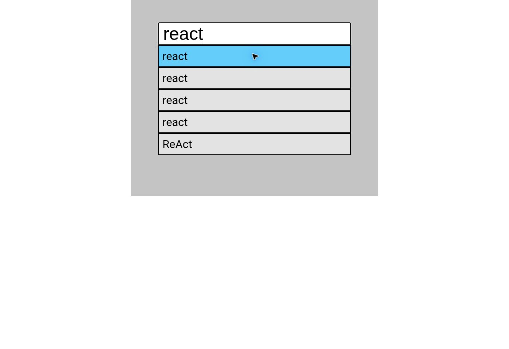

# GitHub Repository Finder

Поиск публичных GitHub-репозиториев с автодополнением на обычном JavaScript.

[Демо](https://milo78k.github.io/project-github-repos/)



## Возможности

- Поиск через GitHub REST API.
- До пяти подсказок по введённому запросу.
- Debounce 500 мс.
- Добавление выбранного репозитория в список с именем, владельцем и количеством звёзд.
- Удаление выбранного элемента из списка.

## Стек

JavaScript, HTML, CSS, Fetch API, DOM API.

## Локальный запуск

Зависимости и сборка не требуются. Запустите статический сервер из папки репозитория:

```bash
python3 -m http.server 8000
```

Откройте `http://localhost:8000`.

## Технические решения и ограничения

Классы View и Search разделяют работу с DOM и загрузку данных. Выбранный список хранится только в DOM и не сохраняется между посещениями. Ошибки API и пустые результаты отображаются в интерфейсе. Устаревшие запросы отменяются. Подсказки доступны с клавиатуры, данные API вставляются как текст. Доступность поиска зависит от лимитов GitHub API. Автоматические тесты не добавлены.
